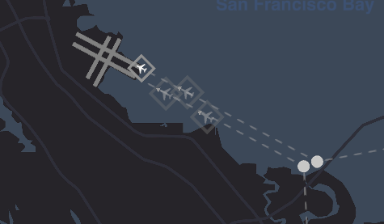

# Mini Airways ILS

A Mini Airways mod making landing waypoint an ILS which makes collision impossible during approach.
Landing waypoint can only be placed a fixed distance away from the runway on the extended runway centerline. You can directly select the runway to place a landing waypoint. Once placed, the landing waypoint can not be moved again.

# How to Install

- Switch the game to `mod_feat` [branch](https://partner.steamgames.com/doc/store/application/branches?) on Steam.
- Copy [MiniAirwaysILS.dll](https://github.com/ericpzh/MiniAirwaysILS/blob/main/bin/Debug/netstandard2.1/MiniAirwaysILS.dll) into `<path_to_game>\Mini Airways\BepInEx\plugins`

***

# 迷你空管ILS

一个让降落航点变成ILS的迷你空管Mod。在降落航点指挥下的飞机不会触发碰撞。
降落航点只能被放在跑道延长线上的一个固定位置，在获得降落航点时选择跑道即可放置，放置后其将不可被再次移动。

# 如何安装

- 右键库中的Mini Airways，[属性 - 测试版 - mod_feat](https://partner.steamgames.com/doc/store/application/branches?l=schinese), 更新。
- 复制[MiniAirwaysILS.dll](https://github.com/ericpzh/MiniAirwaysILS/blob/main/bin/Debug/netstandard2.1/MiniAirwaysILS.dll) 到 `<path_to_game>\Mini Airways\BepInEx\plugins`。
